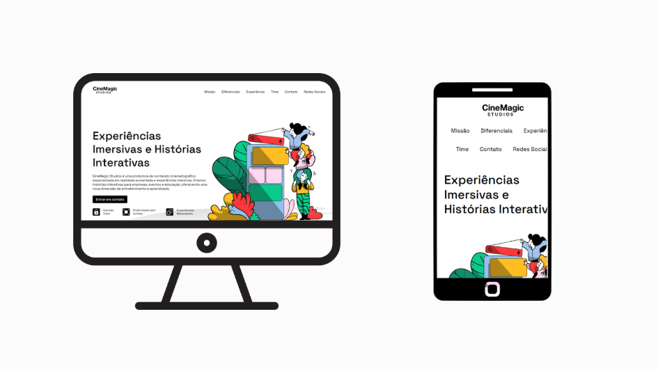

# 🎬 CineMagic Studios - Landing Page

Bem-vindo à documentação oficial da **Landing Page da CineMagic Studios**, um projeto desenvolvido com foco em proporcionar uma experiência visual moderna e responsiva para uma produtora de conteúdo cinematográfico especializada em **realidade aumentada** e **experiências imersivas**.

---
## Prévia do site



## 🌟 Sobre o Projeto

A **CineMagic Studios** é uma produtora de histórias interativas que atende empresas, eventos e projetos educacionais, oferecendo uma nova dimensão de entretenimento e aprendizado.  

Este site foi desenvolvido como uma **landing page moderna**, destacando os principais serviços, equipe e visão da empresa.

🔗 Acesse o site publicado:  
👉 [https://camilyolivei.github.io/landing-page-flavio/](https://camilyolivei.github.io/landing-page-flavio/)

---

## 🛠️ Tecnologias Utilizadas

- **HTML5**  
- **CSS3**  
- **Responsividade com Media Queries**  
- **Editor usado:** [Visual Studio Code](https://code.visualstudio.com/)  
- **Design:** Customizado com foco em estética moderna e UX intuitivo

---

## 👩‍💻 Autores

| Nome                          | Função                                                                 |
|-------------------------------|------------------------------------------------------------------------|
| **Camily Guilherme de Oliveira** | Responsável pelo projeto: HTML, CSS e design gráfico    |

---

## 🧪 Como Testar o Projeto

### ✅ Testar diretamente no navegador (mais fácil):

1. Acesse o site diretamente pelo GitHub Pages:  
   👉 [https://camilyolivei.github.io/landing-page-flavio/](https://camilyolivei.github.io/landing-page-flavio/)

---

### 🖥️ Testar localmente via Git:

> Recomendado se quiser analisar o código, modificar ou visualizar offline.

#### 1. **Clonar o repositório:**

```bash
git clone https://github.com/camilyolivei/landing-page-flavio.git
```

#### 2. **Navegar até a pasta do projeto:**

```bash
cd landing-page-flavio
```

#### 3. **Abrir o arquivo no navegador:**

Você pode dar **duplo clique** no `index.html`, ou digitar:

```bash
start index.html   # Windows
xdg-open index.html # Linux
open index.html     # macOS
```

> Ou ainda, abra a pasta no VS Code e use a extensão *Live Server*.

---

## 📁 Estrutura do Projeto

```
landing-page-flavio/
│
├── assets/                   # Arquivos estáticos do projeto
│   ├── img/                  # Imagens utilizadas no site
│   └── style.css             # Estilos CSS principais
│
├── .gitattributes            # Arquivo de configuração Git
├── README.md                 # Documentação do projeto
├── enviar-formulario.html   # Página de envio do formulário
├── index.html                # Página principal da landing page
```

---

## 📄 Licença

Projeto de **desenvolvimento front-end**, criado exclusivamente para fins acadêmicos e de portfólio.

---

> ✨ Feito com dedicação para mostrar o poder da imaginação através da tecnologia!
